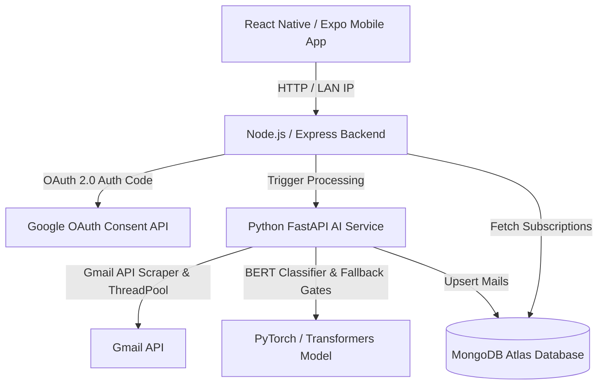

# 🚀 SubTracker (Microsynapse)

**SubTracker**, kullanıcıların Gmail kutularındaki abonelik faturalarını ve makbuzlarını **yapay zeka (BERT NLP)** ve **Google OAuth 2.0** kullanarak otomatik olarak tarayan, sınıflandıran ve mobil uygulama (React Native / Expo) üzerinden takip etmelerini sağlayan uçtan uca akıllı bir abonelik yönetim sistemidir.

---

## 📌 Mimari Genel Bakış

Sistem 3 temel katmandan oluşmaktadır:



1. **`subtracker-frontend` (Mobil Uygulama)**:
   - React Native & Expo SDK 54, React Navigation, Worklets, Dynamic Glassmorphism UI.
   - iOS & Android uyumlu (Expo Go & Development Build).
   - Yerel ağ (LAN IP) ve Ngrok tünelleri üzerinden canlı senkronizasyon.

2. **`subtracker-backend` (Node.js REST API)**:
   - Express.js, Mongoose (MongoDB Atlas), JWT Kimlik Doğrulama.
   - Google OAuth 2.0 İzin ve Callback Yönetimi (`/auth/google`, `/auth/google/callback`).
   - Ngrok tünel entegrasyonu ve dinamik yönlendirme.

3. **`subtracker-AI` (Mikroservis / Yapay Zeka)**:
   - FastAPI & PyTorch (`dbmdz/bert-base-turkish-cased` özelleştirilmiş Türkçe BERT dizilim sınıflandırıcısı - %92 doğruluk oranı).
   - Thread-safe Gmail API mesaj çekici (`AuthorizedHttp` & `ThreadPoolExecutor`).
   - Doğrulama Kapısı (`is_valid_subscription`), Fatura/Makbuz Muafiyet Kuralları (`has_explicit_receipt_or_billing_signal`) ve Regex Ayrıştırıcı.
   - MongoDB `UpdateOne(..., upsert=True)` ile mükerrer abonelik tekilleştirme.

---

## 🛠️ Gereksinimler ve Kurulumlar

### 1. Sistem Gereksinimleri
- **Node.js**: v18.x veya v20.x+
- **Python**: v3.10+ (Sanal ortam `.venv` kullanımı önerilir)
- **MongoDB**: MongoDB Atlas veya Yerel MongoDB
- **Ngrok**: OAuth 2.0 callback yönlendirmeleri için
- **Expo Go App**: iOS App Store / Android Google Play Store (Mobil testler için)

---

## 📦 Kütüphane ve Bağımlılık Kurulumları

### A. Backend Bağımlılıkları (`subtracker-backend`)
```bash
cd subtracker-backend
npm install express mongoose dotenv jsonwebtoken axios cors google-auth-library
```

### B. Frontend Bağımlılıkları (`subtracker-frontend`)
```bash
cd subtracker-frontend
npm install expo react-native expo-linking expo-font @react-navigation/native react-native-worklets @react-native-async-storage/async-storage
```

### C. AI Servis Bağımlılıkları (`subtracker-AI`)
```bash
cd subtracker-AI
python3 -m venv .venv
source .venv/bin/activate   # MacOS/Linux
# .venv\Scripts\activate    # Windows

pip install fastapi uvicorn torch transformers google-api-python-client google-auth-httplib2 httplib2 pymongo beautifulsoup4 scikit-learn python-dateutil requests
```

---

## ⚙️ Çevre Değişkenleri (.env Yapılandırması)

### 1. `subtracker-backend/.env`
```env
PORT=5002
MONGO_URI=mongodb+srv://<username>:<password>@cluster.mongodb.net/subtracker?retryWrites=true&w=majority
JWT_SECRET=your_super_secret_jwt_key
GOOGLE_CLIENT_ID=your_google_client_id.apps.googleusercontent.com
GOOGLE_CLIENT_SECRET=your_google_client_secret
GOOGLE_REDIRECT_URI=https://<your-ngrok-domain>.ngrok-free.dev/auth/google/callback
```

### 2. `subtracker-AI/.env`
```env
MONGO_URI=mongodb+srv://<username>:<password>@cluster.mongodb.net/subtracker?retryWrites=true&w=majority
GOOGLE_CLIENT_ID=your_google_client_id.apps.googleusercontent.com
GOOGLE_CLIENT_SECRET=your_google_client_secret
GOOGLE_REDIRECT_URI=https://<your-ngrok-domain>.ngrok-free.dev/auth/google/callback
```

### 3. `subtracker-frontend/.env`
```env
API_BASE_URL=http://<YOUR_LOCAL_LAN_IP>:5002
```
*(Örnek: `API_BASE_URL=http://192.168.1.43:5002`)*

---

## 🤖 Yapay Zeka Modelini Eğitme (BERT Fine-Tuning)

AI modelini eğitmek veya güncellemek için:
```bash
cd subtracker-AI
source .venv/bin/activate
python3 train_model.py
```
*Bu komut `data/mail1.json` verisetini okur, Apple Silicon GPU (`mps`) veya CUDA/CPU kullanarak `models/bert_model.pt` ağırlık dosyasını en yüksek doğruluk (`best_acc`) checkpoint'i ile üretir.*

---

## 🚀 Projeyi Çalıştırma Adımları

Projeyi çalıştırmak için 4 ayrı terminal penceresi açın:

### 1. Ngrok Tüneli (Google OAuth İle İletişim İçin)
```bash
ngrok http 5002 --url=https://<your-ngrok-domain>.ngrok-free.dev
```

### 2. Node.js Backend Servisi
```bash
cd subtracker-backend
npm run start   # veya node server.js
```

### 3. Python AI Servisi
```bash
cd subtracker-AI
source .venv/bin/activate
uvicorn main:app --host 0.0.0.0 --port 8000 --reload
```

### 4. Expo Frontend (Mobil Uygulama)
```bash
cd subtracker-frontend
npx expo start --clear
```
- QR kodunu **Expo Go** uygulamanız ile tarayarak testi başlatabilirsiniz.

---

## 🧹 Yardımcı Betikler

### Veritabanı Temizleme Betiği
Eski/test amaçlı yazılmış mail kayıtlarını sıfırlamak için:
```bash
node subtracker-backend/scripts/clearMails.js
```

---

## 🔒 Güvenlik ve Filtreleme Mekanizmaları

- **Katı Validasyon Kapısı (`is_valid_subscription`)**: İsim, pozitif tutar ve geçerli tarih içermeyen kayıtlar reddedilir.
- **Fatura / Makbuz Beyanı Muafiyeti (`has_explicit_receipt_or_billing_signal`)**: Fatura ve otomatik ödeme makbuzları, uzun borsa bültenlerinden ayırt edilerek korunur.
- **Borsa / Ekstre / Halka Arz Filtresi**: Piyasa analiz raporları, borsa duyuruları ve kredi kartı ekstreleri otomatik olarak filtrelenir.
- **Mükerrer Kayıt Engelleme**: Aynı servis ve kullanıcı eşleşmesinde `UpdateOne(..., upsert=True)` ile tek bir güncel doküman tutulur.

---

## 📝 Lisans
Bu proje **Microsynapse** ekibi tarafından geliştirilmiştir. Tüm hakları saklıdır.
